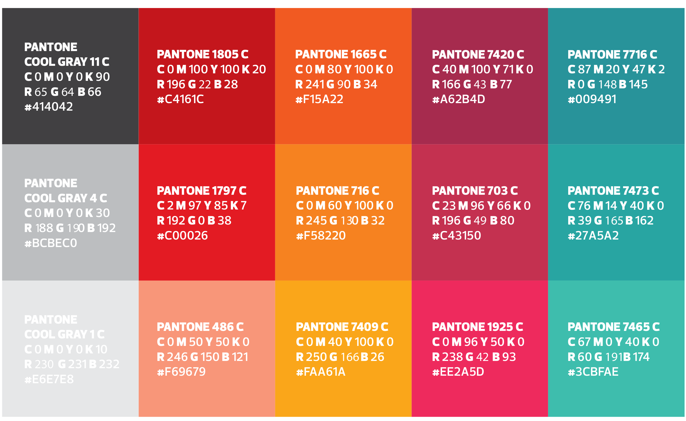

# Cores-Marca-Insper

| Cor                                                             | Pantone        | CMYK                | RGB           | HEX     |
| --------------------------------------------------------------- | -------------- | ------------------- | ------------- | ------- |
|  | COOL GRAY 11 C | 0%, 0%, 0%, 90%     | 65, 64, 66    | #414042 |
|  | COOL GRAY 4 C  | 0%, 0%, 0%, 30%     | 188, 190, 192 | #BCBEC0 |
|  | COOL GRAY 1 C  | 0%, 0%, 0%, 10%     | 230, 231, 232 | #E6E7E8 |
|  | 1805 C         | 0%, 100%, 100%, 20% | 196, 22, 28   | #C4161C |
|  | 1797 C         | 2%, 97%, 85%, 7%    | 232, 7, 36    | #E80724 |
|  | 486 C          | 0%, 50%, 50%, 0%    | 246, 150, 121 | #F69679 |
|  | 1665 C         | 0%, 80%, 100%, 0%   | 241, 90, 34   | #F15A22 |
|  | 716 C          | 0%, 60%, 100%, 0%   | 245, 130, 32  | #F58220 |
|  | 7409 C         | 0%, 40%, 100%, 0%   | 250, 166, 26  | #FAA61A |
|  | 7420 C         | 40%, 100%, 71%, 0%  | 166, 43, 77   | #A62B4D |
|  | 703 C          | 23%, 96%, 66%, 0%   | 196, 49, 80   | #C43150 |
|  | 1925 C         | 0%, 96%, 50%, 0%    | 238, 42, 93   | #EE2A5D |
|  | 7716 C         | 87%, 20%, 47%, 2%   | 0, 148, 145   | #009491 |
|  | 7473 C         | 76%, 0%, 2%, 35%    | 39, 165, 162  | #27A5A2 |
|  | 7465 C         | 67%, 0%, 40%, 0%    | 60, 191, 174  | #3CBFAE |

